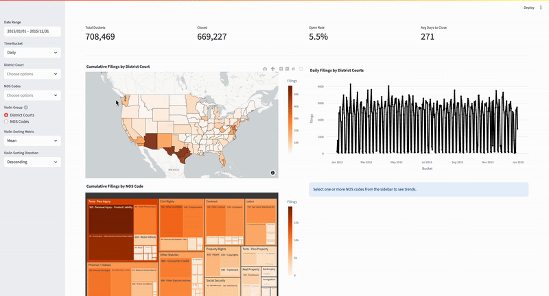

# Judicial Analytics Pipeline

A reproducible data pipeline that fetches CourtListener
district court dockets, transforms them into tidy parquet files, loads them into
PostgreSQL, and serves a Streamlit dashboard.

|       Stage      |                  Script / Tool                  |                          What it does                         |
|------------------|-------------------------------------------------|---------------------------------------------------------------|
| **1. Fetch**     | `fetch_fd_slugs.sh`, `fetch_year_all_courts.sh` | Pull raw JSONL dockets from CourtListener REST API            |
| **2. Transform** | `python -m src.data.transform`                  | Normalize JSONL → parquet (`data/processed/…`)                |
| **3. Ingest**    | `python -m src.data.ingest_sql`                 | Create schema, load parquet into Postgres                     |
| **4. Explore**   | `streamlit run dashboard/app.py`                | Interactive dashboard                                         |

---

## Folder Layout

```
├─ config/ # logging + settings templates
├─ data/
│ ├─ raw/ # raw JSONL from CourtListener
│ └─ processed/ # tidy parquet
├─ sql/ # schema.sql (DDL)
├─ src/ # Python package
│ ├─ data/ # fetch / transform / ingest helpers
│ └─ utils/ # small shared helpers
└─ dashboard/ # Streamlit app
```

---

## Sneak Peek



## Quick Start

```
# 0. Clone & install deps
git clone https://github.com/kai-snyder/judicial_analytics_pipeline.git
cd judicial_analytics_pipeline
python -m venv venv && source venv/bin/activate
pip install -r requirements.txt 
cp .env.example .env           # add your CL_API_TOKEN 

# 1. Fetch a year of dockets
src/data/fetch_year_all_courts.sh     # in the file, change START and END as needed

# 2. Transform JSONL → parquet
python -m src.data.transform

# 3. Spin up Postgres
brew install postgresql@15
brew services start postgresql@15
createuser --interactive --pwprompt   # e.g. user: judicial, pw: ********
createdb -O judicial case_details

# 4. Load parquet into Postgres
python -m src.data.ingest_sql

# 5. Launch the dashboard
export PYTHONPATH=$PYTHONPATH:$(pwd)
streamlit run dashboard/app.py
```

## Environment Variables

Copy `.env.example` → `.env` and fill in as needed.

|      Var       |                             Default                                           | Purpose                                    |
|----------------|-------------------------------------------------------------------------------|--------------------------------------------|
| `CL_API_KEY`   | `<copied from CourtListener's Developer Tools page>`                           | CourtListener API key – higher rate limits |
| `DATABASE_URL` | `postgresql+psycopg2://judicial:<password>@localhost:5432/judicial_analytics` | SQLAlchemy URL used by the pipeline        |

---

## Development Tips

- **Work on one court at a time**  
  Edit `fetch_fd_slugs.sh` (or call `python -m src.data.fetch_courtlistener`) with a single `--court dcd` flag while prototyping.

- **Reset the processed layer**  
  Remove stale parquet files before re-running the transform step:  
  `rm -f data/processed/*.parquet`

- **Skip empty parquet files**  
  `ingest_sql.py` already ignores zero-row files, but you can verify with:  
  `python - <<'PY'`  
  `import glob, pandas as pd, pathlib, sys`  
  `for p in pathlib.Path("data/processed").glob("*.parquet"):`  
  `    if pd.read_parquet(p).empty:`  
  `        print("EMPTY →", p)`  
  `PY`

- **Delete old tables**  
  Remove data sitting in Postgres before re-running the ingest step:  
  `psql -U <user> -c "SELECT pg_terminate_backend(pid) FROM pg_stat_activity WHERE datname = 'judicial_analytics';" # stop any sessions that might be connected first`  
  `dropdb -U <user> judicial_analytics       # drop the DB`  
  `createdb -U <user> judicial_analytics     # create a fresh, empty DB (same owner)`

---

## Dataset/API License

All docket data is fetched from **CourtListener**
(CC0 1.0 Universal Public Domain Dedication).
See <https://www.courtlistener.com/api/bulk-info/> for details.

*When you redistribute any portion of the raw JSONL or processed parquet
produced by this pipeline, please reference CourtListener and retain the CC0 notice.*

---

## Roadmap

| Status |                       Goal                  |                                       Notes                               |
|--------|---------------------------------------------|---------------------------------------------------------------------------|
| ✅     | **Stable ETL** (fetch → transform → ingest) | Handles full date range for all 94 districts.                             |
| ✅     | **Interactive Dashboard**                   | Displays filing frequencies and trends by geography and NOS codes.        |
| ⏳     | **Weekly GitHub Action**                    | Pulls the past 7 days of dockets every Monday.                            |

Legend: ✅ done  ⏳ planned