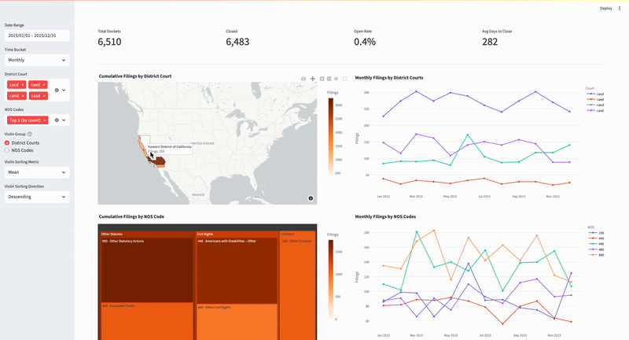

# Judicial Analytics Pipeline

A reproducible data pipeline that fetches CourtListener
district court dockets, transforms them into tidy parquet files, loads them into
PostgreSQL, and serves a Streamlit dashboard.

|       Stage      |                  Script / Tool                  |                          What it does                             |
|------------------|-------------------------------------------------|-------------------------------------------------------------------|
| **1. Fetch**     | `fetch_fd_slugs.sh`, `fetch_year_all_courts.sh` | Pull raw JSONL dockets from CourtListener REST API (`data/raw/…`) |
| **2. Transform** | `python -m src.data.transform`                  | Normalize JSONL → parquet (`data/processed/…`)                    |
| **3. Ingest**    | `python -m src.data.ingest_sql`                 | Create schema, load parquet into Postgres                         |
| **4. Explore**   | `streamlit run dashboard/app.py`                | Kickstart interactive dashboard                                   |

---

## Sneak Peek



The dashboard opens with a date range picker at the top of the sidebar. Selecting new start and end dates triggers fresh queries against Postgres, so every element on the screen (KPIs, map, treemap, line charts, and violin plots) immediately recalculates to reflect only cases filed inside that window.

Beneath the calendar you choose a time bucket granularity (daily, weekly, monthly or yearly). The two time series charts (filings by district court and filings by NOS code) re-aggregate on the fly by changing the SQL `date_trunc` interval, letting you zoom from long-term trends down to day-by-day spikes.

Next is the district court multiselect. Leaving it blank (or picking “All”) keeps the view national and collapses the district line chart to a single composite series. Choosing “Top 5 (by count)” automatically finds the busiest five courts for the current date and NOS slice, while selecting any custom set plots one line per court and shades only those districts on the map. All downstream charts, including the treemap and latency violins, inherit the same court filter. Please note 

The NOS code multiselect works in parallel. You can leave it blank to include every Nature of Suit, restrict the view to the five most common codes within the current court slice, or focus on any specific set. Changing this list updates KPI counts, trims the treemap to the chosen leaves, filters the NOS line chart, and narrows the data feeding the latency violins. 

**Please note to not select "Top 5 (by count)" for both district court and NOS code multiselects as the data fails to load properly.**

Below the core filters is a radio button that switches the violins’ x-axis between district courts and NOS codes. This lets you study closing time distributions by geography or by legal topic without touching the other charts.

Finally, two selectors control how the violins are ordered. One lets you pick the statistic (mean, median, first quartile, third quartile, minimum or maximum) used to rank the groups, while the other flips the sort direction. Each adjustment recomputes the ordering before Plotly redraws the chart.

In sum, the sidebar settings cascade through every query so that volume, geography, topical mix, temporal trends and case closing speed stay in perfect sync as you explore.

---

## Folder Layout

```
├─ config/ # logging + settings templates
├─ data/
│ ├─ raw/ # raw JSONL from CourtListener
│ └─ processed/ # tidy parquet
├─ sql/ # schema.sql (DDL)
├─ src/ # Python package
│ ├─ data/ # fetch / transform / ingest helpers
│ └─ utils/ # small shared helpers
└─ dashboard/ # Streamlit app
```

## Quick Start

```
# 0. Clone & install deps
git clone https://github.com/kai-snyder/judicial_analytics_pipeline.git
cd judicial_analytics_pipeline
python -m venv venv && source venv/bin/activate
pip install -r requirements.txt 
cp .env.example .env           # add your CL_API_TOKEN 

# 1. Fetch a year of dockets
src/data/fetch_year_all_courts.sh     # in the file, change START and END as needed

# 2. Transform JSONL → parquet
python -m src.data.transform

# 3. Spin up Postgres
brew install postgresql@15
brew services start postgresql@15
createuser --interactive --pwprompt   # e.g. user: judicial, pw: ********
createdb -O judicial case_details

# 4. Load parquet into Postgres
python -m src.data.ingest_sql

# 5. Launch the dashboard
export PYTHONPATH=$PYTHONPATH:$(pwd)
streamlit run dashboard/app.py
```

## Environment Variables

Copy `.env.example` → `.env` and fill in as needed.

|      Var       |                             Default                                           | Purpose                                    |
|----------------|-------------------------------------------------------------------------------|--------------------------------------------|
| `CL_API_KEY`   | `<copied from CourtListener's Developer Tools page>`                           | CourtListener API key – higher rate limits |
| `DATABASE_URL` | `postgresql+psycopg2://judicial:<password>@localhost:5432/case_details` | SQLAlchemy URL used by the pipeline        |

---

## Development Tips

- **Work on one court at a time**  
  Edit `fetch_fd_slugs.sh` (or call `python -m src.data.fetch_courtlistener`) with a single `--court dcd` flag while prototyping.

- **Reset the processed layer**  
  Remove stale parquet files before re-running the transform step:  
  `rm -f data/processed/*.parquet`

- **Skip empty parquet files**  
  `ingest_sql.py` already ignores zero-row files, but you can verify with:  
  `python - <<'PY'`  
  `import glob, pandas as pd, pathlib, sys`  
  `for p in pathlib.Path("data/processed").glob("*.parquet"):`  
  `    if pd.read_parquet(p).empty:`  
  `        print("EMPTY →", p)`  
  `PY`

- **Delete old tables**  
  Remove data sitting in Postgres before re-running the ingest step:  
  `psql -U <user> -c "SELECT pg_terminate_backend(pid) FROM pg_stat_activity WHERE datname = 'case_details';" # stop any sessions that might be connected first`  
  `dropdb -U <user> case_details       # drop the DB`  
  `createdb -U <user> case_details     # create a fresh, empty DB (same owner)`

---

## Dataset/API License

All docket data is fetched from **CourtListener**
(CC0 1.0 Universal Public Domain Dedication).
See <https://www.courtlistener.com/api/bulk-info/> for details.

*When you redistribute any portion of the raw JSONL or processed parquet
produced by this pipeline, please reference CourtListener and retain the CC0 notice.*

---

## Roadmap

| Status |                       Goal                  |                                       Notes                               |
|--------|---------------------------------------------|---------------------------------------------------------------------------|
| ✅     | **Stable ETL** (fetch → transform → ingest) | Handles full date range for all 94 districts.                             |
| ✅     | **Interactive Dashboard**                   | Displays filing frequencies and trends by geography and NOS codes.        |
| ⏳     | **Weekly GitHub Action**                    | Pulls the past 7 days of dockets every Monday.                            |

Legend: ✅ done  ⏳ planned